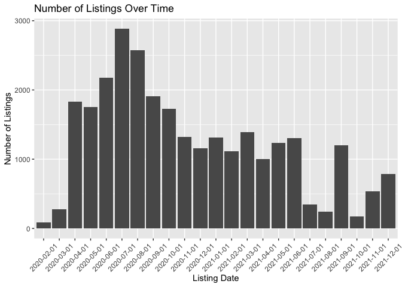
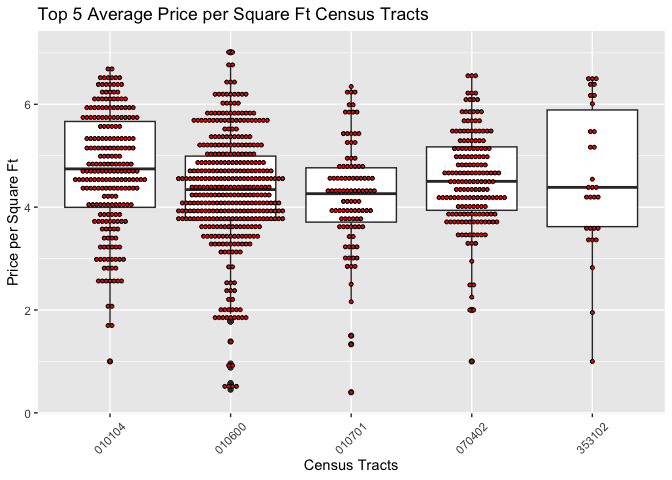
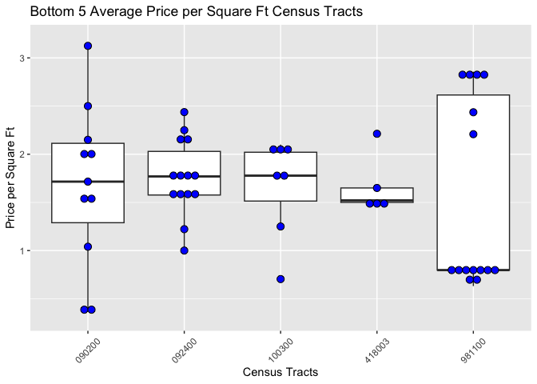

README - Craigslist Data
================
Blair Wong
2023-02-10

### Overview

The Craigslist data scraped by
[BARI](https://dataverse.harvard.edu/dataset.xhtml?persistentId=doi:10.7910/DVN/52WSPT)
contains listings from the state of Massachusetts across five different
regions (Boston, Cape Cod, South Coast, Western Mass, and Worcester)
from February 2020 until December 2021. There are a total of 205,450
rows, and 14 variables including listing ID, listing date, price, square
footage, location, and census tract. This data could be useful for
analyzing the state of the Massachusetts rental market, especially in
the aftermath of the COVID-19 pandemic.

### Fun Facts

Considering the listings within the city of Boston and its surrounding
cities:

- The census tract with the most listings is 354100 in Cambridge (around
  Harvard Square), with a total of 2,808 listings.
- The census tract with the highest average price per square foot value
  of \$4.69/sqft is 010104, which is in Kenmore/Back Bay.
- There are 12,394 listings in Boston, and 15,964 listings in the
  surrounding cities.
- July 2020 had the highest number of listings (1,221 listings), and
  October 2021 saw the least amount of listings (65 listings).
- 9,932 listings allowed dogs, while 14,842 listings allowed cats.
  13,081 listings did not allow pets at all.
- The average rent in the city of Boston was \$2,660.70 per month. The
  average rent in the surrounding cities was \$2,484.92 per month.
- The average square footage of a Craigslist listing was 1,013.825
  square feet, which is about the size of a two-bedroom apartment.

### Visualization

This graph shows the number of listings over time. As previously
mentioned, the highest number of listings were in July 2020, and the
lowest was in October 2021. One of the possible reasons for why the
listings were higher in the summer of 2020 is because of the higher
number of people leaving the city due to the COVID-19 pandemic.
Interestingly, summer and fall 2021 did not see the same number of
listings. This potentially indicates that there is less of an exodus
from the city. September 2021 saw higher numbers as expected due to the
return of college students.
<!-- -->

The first box plot visualization shows the top five census tracts with
the highest average price per square foot. Each red dot represents a
specific listing. The second box plot visualization shows the same,
except with the bottom five census tracts (the lowest average price per
square foot), and each blue dot represents a listing. It is interesting
to note that the census tracts with higher price per square foot values
have significantly more listing than the census tracts with the lowest
values. This ultimately provides an interesting insight into the
landlords/brokers and potential tenants who use Craigslist as a means of
finding a rental as it shows that Craigslist is perhaps more frequently
used in more expensive areas.

<!-- -->

<!-- -->
