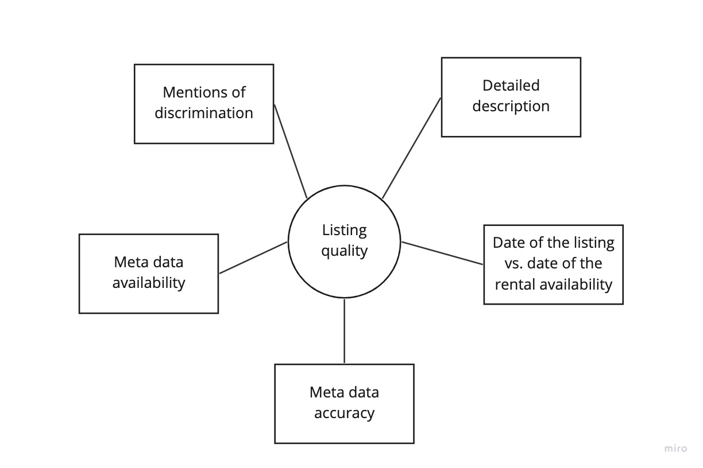
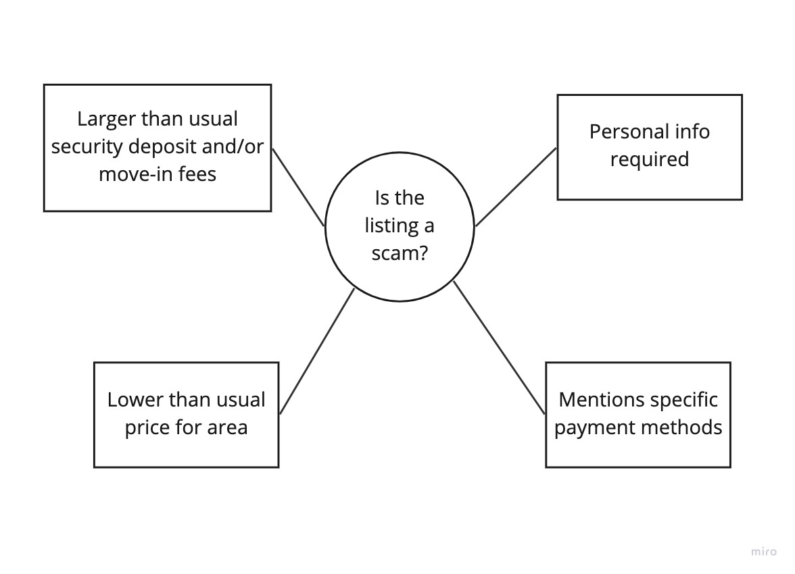

## Background

With the Craigslist data, I would like to measure two latent constructs: the quality of the listing, and whether the listing is a scam. The overall quality of the listings is important to measure because it could shed some light on which neighborhoods have the most promising listings, and which areas do not. It would also be interesting to see if there were any flunctations in listing quality throughout the COVID-19 pandemic. Scams are also very prevalent on Craigslist and rental sites in general. It would be important to identify and determine which listings are scams so that we can better understand how the platform is taken advantage of by scammers and also so that we can have a more accurate count of available rentals in Boston.

## Methods

#### Listing Quality

To measure the listing quality, the manifest variables that I will use are: 

- whether the listing has a detailed description
- the date of the listing versus the date of the rental availability
- whether metadata for the listing is available (square footage, price, pets, etc.)
- the accuracy of the metadata
- whether the description contains any mentions of discrimination (for example, voucher discrimination)

#### Scams

To measure whether the listing is a scam, the manifest variables that I will use are:

- Significantly larger than usual security deposit and/or move in fees
- Whether personal information is required to contact the person who listed the rental
- Lower than usual price for the area
- Mentions of specific payment methods (for example, wiring money)

## Potential Biases

For listing quality, there may be potential biases around the listing's metadata. There are some landlords who may have high quality listings but are unfamiliar with technology and don't know how to fill out the metadata. However, accuracy of the metadata when it is available might be a better indicator of the listing quality.

In terms of scams, there may be bias in the proposed manifest variable of the lower price than usual. While most listings that have a significantly lower proces are suspect, there may be some landlords who genuinely do want to offer their listing at a lower price to either help low-income families or because they are not looking to make money from their rental.

## Implications

It is important to understand the quality of listings and whether they are scams because the consequences of a harmful listing can have a lasting impact on low-income individuals or families seeking rentals. For example, for families with vouchers, they already have a very limited window to search for apartments. If they do not find an apartment in time, then their voucher may expire and they would have to navigate the years-long voucher program all over again. Thus, families and individuals with vouchers cannot afford to waste time or energy dealing with low quality listings and scammers. On top of that, if the scammers are successful, low-income families face even harsher repercussions because they do not have the means or the financial safety net to bounce back as quickly as a higher-income family. Ultimately, analysis of the quality of listings could contribute to any efforts related to holding landlords and property managers accountable, and catching scammers.
