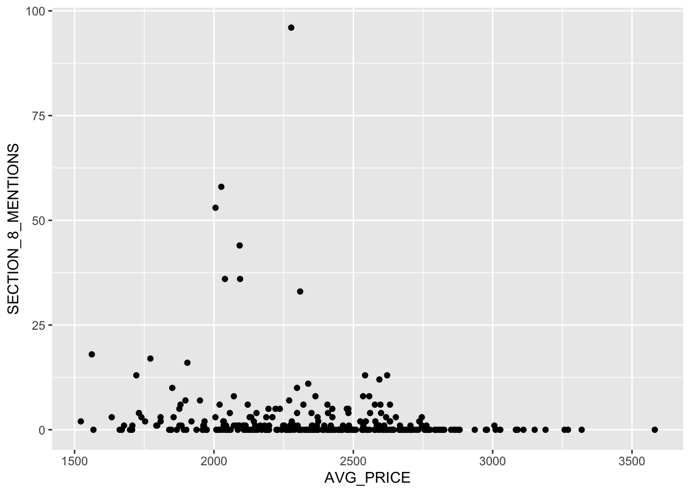

```{r setup, include=FALSE, echo=FALSE}
knitr::opts_chunk$set(echo = TRUE)
```

```{r echo=FALSE}
library(tidyverse)
library(stringr)
library(sf)
library(ggplot2)
library(ggmap)
library(patchwork)
library(gridExtra)
```

```{r echo=FALSE}
# Importing Data
craigslist_listings<-read.csv('CRAIGSLIST.Listings.csv')
census_tract_boston<-read.csv('../census-tract-data-boston.csv')

# Create & append lists
census_tract_list_bos<-as.list(census_tract_boston$GEOCODE)

# Filter by census tract ID's
craigslist_listings<-craigslist_listings %>% filter(CT_ID_10 %in% census_tract_list_bos) %>% select(LISTING_ID,LISTING_YEAR,LISTING_MONTH,LISTING_DAY,BODY,LOCATION,AREA_SQFT,PRICE,CT_ID_10)

# AGGREGATIONS

# Number of listings per CT
ct_listings<-data.frame(table(craigslist_listings$CT_ID_10))
colnames(ct_listings)<-c("CT_ID_10", "COUNT")

# Price
ct_price_avg<-craigslist_listings %>%
  group_by(CT_ID_10) %>%
  summarise(AVG_PRICE=mean(PRICE))

ct_price_min<-craigslist_listings %>%
  group_by(CT_ID_10) %>%
  summarise(MIN_PRICE=min(PRICE))

ct_price_max<-craigslist_listings %>%
  group_by(CT_ID_10) %>%
  summarise(MAX_PRICE=max(PRICE))

ct_price<-craigslist_listings %>%
  group_by(CT_ID_10) %>%
  summarise(AVG_PRICE=mean(PRICE),
            MIN_PRICE=min(PRICE),
            MAX_PRICE=max(PRICE),
            PRICE_OUTLIERS=(sum(PRICE < 300)))

# Square Ft
ct_sqft<-filter(craigslist_listings, !is.na(AREA_SQFT))
ct_sqft<-ct_sqft %>%
  group_by(CT_ID_10) %>%
  summarise(AVG_SQFT=mean(AREA_SQFT, na.rm = TRUE),
            MIN_SQFT=min(AREA_SQFT, na.rm = TRUE),
            MAX_SQFT=max(AREA_SQFT, na.rm = TRUE),
            SQFT_outliers=(sum((AREA_SQFT > 3000) | (AREA_SQFT < 150))))

# Section 8
craigslist_listings$SECTION_8 <- as.integer(grepl('section 8', craigslist_listings$BODY, fixed = FALSE, ignore.case = TRUE) | grepl('voucher', craigslist_listings$BODY, fixed = FALSE, ignore.case = TRUE))
craigslist_listings$NO_SECTION_8 <- as.integer(grepl('No section 8', craigslist_listings$BODY, fixed = TRUE) | grepl('no section 8', craigslist_listings$BODY, fixed = TRUE))

ct_sec8<-craigslist_listings %>%
  group_by(CT_ID_10) %>%
  summarise(NO_SECTION_8=sum(NO_SECTION_8),
            SECTION_8_MENTIONS=sum(SECTION_8))

ct_sec8$YES_SECTION_8<-(ct_sec8$SECTION_8_MENTIONS - ct_sec8$NO_SECTION_8)

# Missing meta data
craigslist_listings$MISSING_DATA <- ifelse(is.na(craigslist_listings$AREA_SQFT) | (craigslist_listings$LOCATION == ''), 1, 0)

ct_missing_data<-craigslist_listings %>%
  group_by(CT_ID_10) %>%
  summarise(MISSING_DATA=sum(MISSING_DATA))

# Body length
craigslist_listings$BODY_STRING_COUNT <- str_count(craigslist_listings$BODY, '\\w+')
craigslist_listings$BODY_STR_COUNT_LESS <- ifelse(craigslist_listings$BODY_STRING_COUNT < 15, 1, 0)
craigslist_listings$BODY_STR_COUNT_OVER <- ifelse(craigslist_listings$BODY_STRING_COUNT > 1500, 1, 0)
ct_body_str_count<-craigslist_listings %>%
  group_by(CT_ID_10) %>%
  summarise(BODY_STR_COUNT_LESS=sum(BODY_STR_COUNT_LESS),
            BODY_STR_COUNT_OVER=sum(BODY_STR_COUNT_OVER),
            AVG_BODY_STR=mean(BODY_STRING_COUNT))

# Cash only
craigslist_listings$CASH_ONLY <- as.integer(grepl('cash only', craigslist_listings$BODY, fixed = FALSE, ignore.case = TRUE))
ct_cash_only<-craigslist_listings %>%
  group_by(CT_ID_10) %>%
  summarise(CASH_ONLY=sum(CASH_ONLY))

# Merge
ct_stats<-merge(ct_listings, ct_price, by = 'CT_ID_10')
ct_stats<-merge(ct_stats, ct_sqft, by ='CT_ID_10')
ct_stats<-merge(ct_stats, ct_sec8, by ='CT_ID_10')
ct_stats<-merge(ct_stats, ct_missing_data, by = 'CT_ID_10')
ct_stats<-merge(ct_stats, ct_body_str_count, by = 'CT_ID_10')
ct_stats<-merge(ct_stats, ct_cash_only, by = 'CT_ID_10')
```

# Background

Building on the variables that were previously created to measure listing quality, I will hone in on the variables related to Section 8. For this exploration, I will explore the Section 8 data in a map in order to show the distribution of listings that mention Section 8/housing vouchers. In addition to Section 8 data from Craigslist, I will leverage data provided by the Department of Housing and Urban Development (HUD). First, I will look at the [low to moderate income population by tract](https://hudgis-hud.opendata.arcgis.com/datasets/HUD::low-to-moderate-income-population-by-tract/about) which "identifies U.S. Census Tracts in which 51% or more of the households earn less than 80 percent of Area Median Income (AMI)". In addition to the low to moderate income population, I will also explore the [Housing Choice Vouchers by Tract](https://hudgis-hud.opendata.arcgis.com/datasets/HUD::housing-choice-vouchers-by-tract/about) which contains "information for Housing Choice Voucher (HCV) recipients aggregated to 2010 U.S. Census Tract geography."

# Methods

I first imported the data and filtered it by the Census tracts in Boston.

```{r}
# Importing low to medium income data & filtering by Boston census tracts
ltm<-st_read('tracts/Low_to_Moderate_Income_Population_by_Tract/Low_to_Moderate_Income_Population_by_Tract.shp')
ltm_boston<-ltm %>% filter(GEOID %in% census_tract_list_bos)

# Importing HCV & filtering by Boston census tracts
hcv<-st_read('tracts/Housing_Choice_Vouchers_by_Tract/HOUSING_CHOICE_VOUCHERS_BY_TRACT.shp')
hcv_boston<-hcv %>% filter(GEOID %in% census_tract_list_bos)
```

I then created a base Boston map using `ggmap`.

```{r}
boston<-get_map(location=c(left = -71.193799, 
                           bottom = 42.22, 
                           right = -70.985746, 
                           top = 42.43),
                source="stamen")
boston_map<-ggmap(boston)
boston_map
```

Afterwards, I added additional layers to the map. First, I created a map with the percentage of low to moderate income families data.

```{r}
ltm_map<-boston_map + geom_sf(data=ltm_boston, aes(fill=LOWMODPCT), inherit.aes = FALSE) +
  scale_fill_gradient(high = "purple", low = "orange") + 
  labs(fill = "Percentage of \nLow to Moderate \nIncome Families")
```

I then created a map for the percentage of renter occupied housing units with HCVs.

```{r}
per_hcv_map<-boston_map + geom_sf(data=hcv_boston[hcv_boston$HCV_PCT_RE>0,], aes(fill=HCV_PCT_RE), inherit.aes = FALSE) +
  scale_fill_gradient(high = "purple", low = "orange") + 
  labs(fill = "Percentage Renter \nOccupied Housing Units \nwith HCV")
```

Finally, I created a map using the Section 8 data from Craigslist that shows the number of Section 8 mentions across census tracts. However, I first had to merge the data from Craigslist.

```{r}
colnames(hcv_boston)[colnames(hcv_boston) == 'GEOID'] = "CT_ID_10"
ct_stats<-merge(hcv_boston, ct_stats, by = "CT_ID_10")

num_sec8_mentions_map<-boston_map + geom_sf(data=ct_stats, aes(fill=SECTION_8_MENTIONS), inherit.aes = FALSE) + 
  scale_fill_gradient(high = "purple", low = "orange") + 
  labs(fill = "Number of Section 8 Mentions")
```

# Analysis

#### Percentage of Low to Moderate Income Families

```{r echo=FALSE}
ltm_map
```

Based on the map above, areas with the highest percentage of low to moderate income families are south of downtown. The census tract with the highest percentage is 981100, which covers Jamaica Plain, Mattapan, and Roslindale, at 100%. In addition to 981100, census tract 980300 (Roxbury) also has a high percentage at 100%. Interestingly, within the same neighborhood of Jamaica Plain, the census tract 120105 only has 8.91% of low to moderate income.

One consideration is that this data is based on the 2010 census, which means that the data may potentially be outdated.

#### Percentage of Renter Occupied Housing Units witih HCV

```{r echo=FALSE}
per_hcv_map
```

Looking at the percentage of renter occupied housing units with HCV, the same census tract 981100 contains a high percentage (61.43%). No other census tract had as many households with HCVs, with a majority hovering around 20 to 40%. Additionally, there are some census tracts without any data at all, indicating that there are no renter-occupied households with HCVs.

#### Number of Craigslist Listings that Mention Section 8

```{r echo=FALSE}
num_sec8_mentions_map
```

Finally, looking at the map with Section 8 mentions from Craigslist, it is clear that a significant majority of listings do not mention Section 8 at all. The one census tract with a high number of mentions (58 mentions) is 110502, which is in Roslindale. However, looking at the listings within the the 110502 census tract, it appears that there are multiple listings with the same `BODY`, which means that the poster is likely posting the same listing over and over again. Thus, the number of listings that mention Section 8 are likely to be significantly lower than 58.

```{r figurename, echo=FALSE, fig.cap="Average Price and Section 8 Mentions", out.width = '90%'}

```

Looking at the plot created in the last exploration, a majority of the census tracts have below 25 mentions. Assuming anything above 25 is an outlier, a new map is shown below.

```{r}
num_sec8_mentions_map_v2<-boston_map + geom_sf(data=ct_stats[ct_stats$SECTION_8_MENTIONS<25,], aes(fill=SECTION_8_MENTIONS), inherit.aes = FALSE) +
  scale_fill_gradient(high = "purple", low = "orange") + 
  labs(fill = "Number of Section 8 Mentions")
num_sec8_mentions_map_v2
```

With the updated map, a majority of listings still do not mention Section 8, and there are very few that have listings that do mention Section 8. The census tract with the highest number of mentions (16) is 140300 in Hyde Park.

# Interpretation & Implications

While there are a handful of options for low to moderate income families to find housing besides vouchers (notably public housing and mixed-income housing), housing choice vouchers are sometimes praised as one of the most effective ways of addressing the housing crisis. One of the goals of vouchers is to de-concentrate poverty by allowing families to move to higher-income neighborhoods. However, looking at the percentage of low to moderate income families map & the percentage of renter occupied housing units with HCV, we can see that the voucher program was not overwhelmingly successful at de-concentrating low-income families since census tract 981100 contains the highest levels in both graphs. Additionally, most of the tracts with a higher percentage in the low to moderate income graph are aligned with the tracts in the percentage of units with HCVs. 

The final map of section 8 mentions in Craigslist listings is especially bleak since a majority of tracts do not have listings that mention vouchers. How can families with vouchers move to higher-income neighborhoods if listings do not explicitly welcome them? We already know that the housing search with a voucher is stressful and time-limited, which means that families with vouchers are not set up for success from the start.

The three maps offer critiques of the housing choice voucher program because we can see that the HCV program did not fully achieve its goal of dispersing concentrated poverty, still concentrating low-income families in the same census tracts. This ultimately shows that there is significant work to be done in ensuring that landlords do not discriminate against voucher holders and ensuring that the voucher application/search process is as streamlined as possible. This should also bolster conversations around other solutions to the housing crisis, as we can see that vouchers do not fully meet the needs of low to moderate income families.